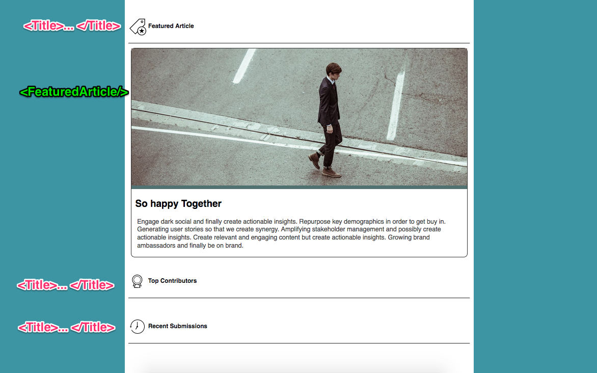

# React Basics

## Configuration

```sh
# 1) navigate to warmups
cd ~/muktek/warmups

# 2) clone this repository
git clone «name-of-this-repo»

# 3) download node_modules
npm install

# 4) open atom, then execute create-react-app task runner
atom .
npm start

```

## Assignment

1) Import App component in `index.js` and pass to `ReactDOM.render(...)`

2) Import styles in `index.js`

3) In `App.js`, import components + include based on mockup below

4) Question: What does `this.props.children` do? (from `Title.js`)


## Mockup


